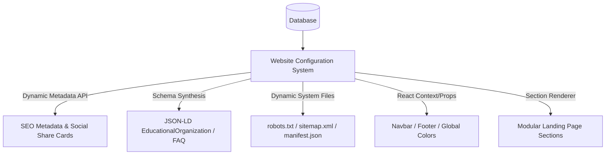
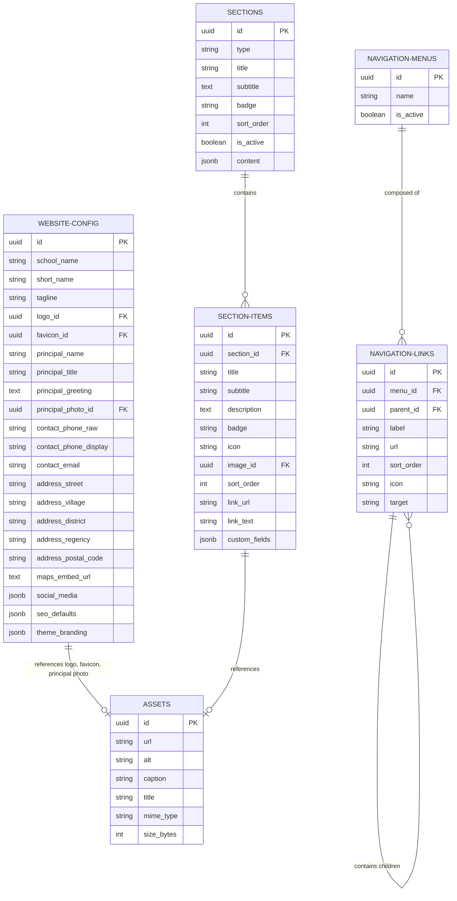
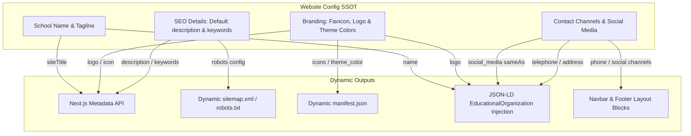
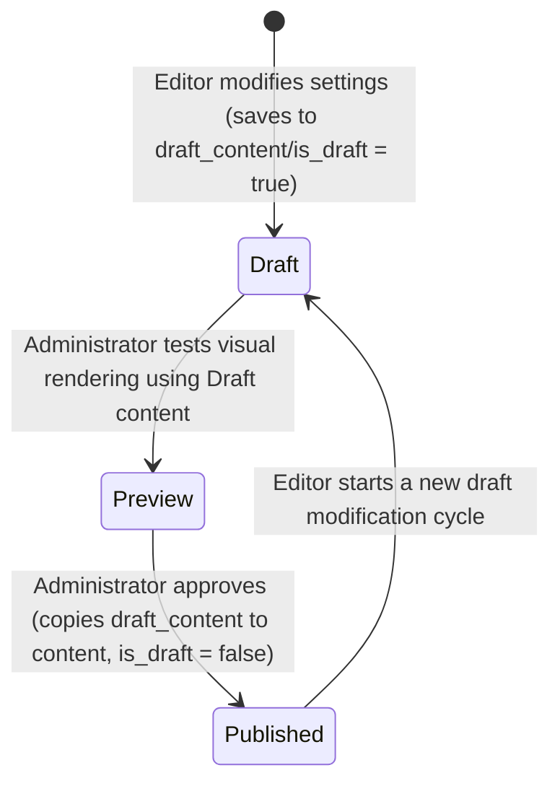
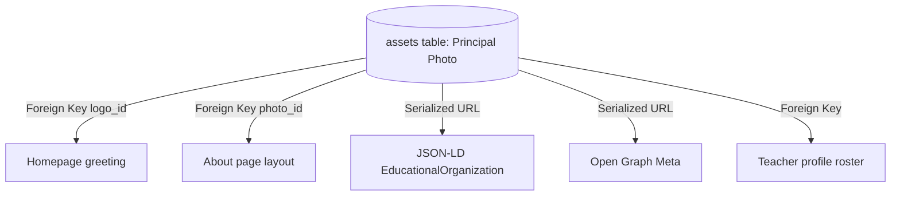
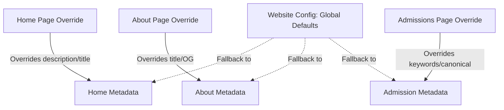
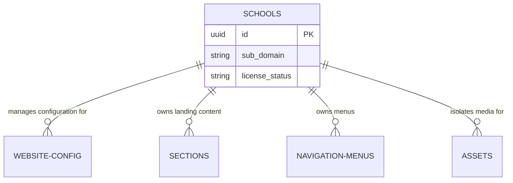

# SIUBA Website Configuration & Modular CMS Content Architecture Design

This document serves as the **Single Source of Truth (SSOT)** for the Website Configuration System and CMS implementation of the SIUBA platform. It defines how the system decouples presentation from structure, transitioning from a basic landing page editor to a unified, scalable configuration engine.

---

## Executive Summary: Single Source of Truth (SSOT)

Instead of hardcoding school identity or configuration options within the React codebase or maintaining separate tables for every visual section, the SIUBA platform uses a centralized **Website Configuration System**.

Any change to the global website configuration dynamically propagates across:
1.  **Public UI Elements**: Landing page, Navbar, Footer, and Principal Greeting.
2.  **SEO Metadata**: Title templates, Meta description, Keywords, Open Graph, Twitter Cards, Favicon, and App Manifest.
3.  **Search Crawler Assets**: Dynamic `robots.txt`, `sitemap.xml`, and JSON-LD structured schema.



---

## 1. Global Website Configuration & Identity Schema

Global configurations are stored in the database as singletons or key-value structures. This ensures that any update to the school's identity immediately updates all references.

### 1.1 `website_config` Table
This table holds the active configuration parameters. To allow flexibility, it can be implemented as a key-value store or as a single-row structure. Below is the structured representation:

| Field | Type | Description |
| :--- | :--- | :--- |
| `school_name` | String | Full legal name of the school (e.g., `"PKBM Baitusyukur Learning Center"`). |
| `short_name` | String | Abbreviated name for UI/Manifest (e.g., `"SIUBA"`). |
| `tagline` | String | Core slogan or tagline (e.g., `"Mendidik dengan Hati, Membina dengan Qur'an"`). |
| `logo_id` | Foreign Key | References `assets.id` for the main site logo. |
| `favicon_id` | Foreign Key | References `assets.id` for the browser favicon. |
| `principal_name` | String | Full name of the school principal. |
| `principal_title` | String | Job title (e.g., `"Kepala Sekolah PKBM Baitusyukur"`). |
| `principal_greeting` | Text | Welcoming letter/greeting from the principal. |
| `principal_photo_id` | Foreign Key | References `assets.id` for the principal's official profile picture. |
| `contact_phone_raw` | String | Raw dialer string (e.g., `"+6289655496283"`). |
| `contact_phone_display`| String | Human-readable phone format (e.g., `"0896-5549-6283"`). |
| `contact_email` | String | Official school email address. |
| `address_street` | String | Street and number. |
| `address_village` | String | Kelurahan/Desa. |
| `address_district` | String | Kecamatan. |
| `address_regency` | String | Kota/Kabupaten. |
| `address_postal_code` | String | Zip code. |
| `maps_embed_url` | Text | Google Maps embed template URL. |
| `social_media` | JSON | Key-value store for social networks (Instagram, Facebook, YouTube, WhatsApp). |
| `seo_defaults` | JSON | Global SEO configurations (default keywords, fallback title, default OG Image). |
| `theme_branding` | JSON | Theme styling overrides (brand colors in hex, font choices). |

---

## 2. Dynamic SEO, JSON-LD & Crawler Asset Generation

All metadata and search engine definitions are generated dynamically by pulling data directly from the `website_config` and current content records.

### 2.1 Dynamic SEO Metadata (Next.js `generateMetadata`)
In Next.js, metadata is returned dynamically from a root layout or page using `generateMetadata`. No hardcoded strings exist in React files.

```typescript
// Example of dynamic metadata output in app/layout.tsx
import { getWebsiteConfig } from "@/lib/api/config";

export async function generateMetadata() {
  const config = await getWebsiteConfig();
  const title = `${config.school_name} - ${config.tagline}`;
  const description = config.seo_defaults.default_description;
  const logoUrl = config.logo?.url;

  return {
    title: {
      default: title,
      template: `%s | ${config.short_name}`,
    },
    description,
    keywords: config.seo_defaults.default_keywords,
    icons: {
      icon: config.favicon?.url || "/favicon.ico",
      apple: config.favicon?.url || "/apple-icon.png",
    },
    openGraph: {
      title,
      description,
      url: config.seo_defaults.canonical_base_url,
      siteName: config.school_name,
      images: [
        {
          url: config.seo_defaults.default_og_image || logoUrl,
          alt: config.school_name,
        },
      ],
      type: "website",
    },
    twitter: {
      card: "summary_large_image",
      title,
      description,
      images: [config.seo_defaults.default_og_image || logoUrl],
    },
    alternates: {
      canonical: config.seo_defaults.canonical_base_url,
    },
  };
}
```

### 2.2 Dynamic JSON-LD Structured Data
To ensure structural indexability, the platform dynamically renders a `<script type="application/ld+json">` tag on the landing page based on school settings:

```typescript
// Injected into the document body
export async function generateJsonLd() {
  const config = await getWebsiteConfig();
  
  return {
    "@context": "https://schema.org",
    "@type": "EducationalOrganization",
    "name": config.school_name,
    "alternateName": config.short_name,
    "url": config.seo_defaults.canonical_base_url,
    "logo": config.logo?.url,
    "image": config.principal_photo?.url,
    "description": config.tagline,
    "address": {
      "@type": "PostalAddress",
      "streetAddress": config.address_street,
      "addressLocality": config.address_district,
      "addressRegion": config.address_regency,
      "postalCode": config.address_postal_code,
      "addressCountry": "ID"
    },
    "contactPoint": {
      "@type": "ContactPoint",
      "telephone": config.contact_phone_raw,
      "contactType": "customer service",
      "email": config.contact_email
    },
    "sameAs": Object.values(config.social_media).filter(Boolean)
  };
}
```

### 2.3 Dynamic Search & Manifest Routings
- **Sitemap (`app/sitemap.ts`)**: Generates an XML sitemap of all active routes, using the `canonical_base_url` defined in the global configuration.
- **Robots (`app/robots.ts`)**: Reads crawler rules (`allowRules`, `disallowRules`) from `website_config` to serve a custom `robots.txt` dynamically.
- **Manifest (`app/manifest.ts`)**: Returns standard PWA Manifest configurations (like `name`, `short_name`, `theme_color`, and `icons`) using branding configurations from `website_config`.

---

## 3. Modular & Extensible Landing Page Section Architecture

To prevent database bloat and eliminate the need to modify database schemas whenever a new section is introduced, the system replaces single-purpose section tables with a **modular section entity-relationship model**.

### 3.1 Core Database Tables

#### Table 1: `assets` (Centralized Media Library)
Stores references to media assets alongside mandatory alt text, titles, and captions to optimize search engines.

```sql
CREATE TABLE assets (
    id UUID PRIMARY KEY DEFAULT gen_random_uuid(),
    url VARCHAR(512) NOT NULL,
    alt VARCHAR(255) NOT NULL,
    caption VARCHAR(512),
    title VARCHAR(255),
    mime_type VARCHAR(100),
    size_bytes INT,
    created_at TIMESTAMP DEFAULT CURRENT_TIMESTAMP,
    updated_at TIMESTAMP DEFAULT CURRENT_TIMESTAMP
);
```

#### Table 2: `sections` (Modular Landing Page Blocks)
Holds structural data for every component block. Adding, removing, or reordering sections requires zero database schema modifications.

```sql
CREATE TABLE sections (
    id UUID PRIMARY KEY DEFAULT gen_random_uuid(),
    type VARCHAR(50) NOT NULL, -- e.g., 'hero', 'why-choose-us', 'about', 'faq', etc.
    title VARCHAR(255),
    subtitle TEXT,
    badge VARCHAR(100),
    sort_order INT NOT NULL DEFAULT 0,
    is_active BOOLEAN NOT NULL DEFAULT TRUE,
    content JSONB, -- Stores custom section-specific fields (e.g., button colors, show_badge flag)
    created_at TIMESTAMP DEFAULT CURRENT_TIMESTAMP,
    updated_at TIMESTAMP DEFAULT CURRENT_TIMESTAMP
);
```

#### Table 3: `section_items` (Extensible Repeater Items)
Handles collections and repeaters (e.g., slides in Hero, cards in Why Choose Us, milestones in School Life, questions in FAQ, reviews in Testimonials).

```sql
CREATE TABLE section_items (
    id UUID PRIMARY KEY DEFAULT gen_random_uuid(),
    section_id UUID NOT NULL REFERENCES sections(id) ON DELETE CASCADE,
    title VARCHAR(255),
    subtitle VARCHAR(255),
    description TEXT,
    badge VARCHAR(100),
    icon VARCHAR(100), -- Lucide icon name, e.g., 'BookOpen', 'Activity'
    image_id UUID REFERENCES assets(id) ON DELETE SET NULL,
    sort_order INT NOT NULL DEFAULT 0,
    link_url VARCHAR(512),
    link_text VARCHAR(100),
    custom_fields JSONB, -- Stores any extra structural attributes (e.g., Grid width '1/3', theme 'emerald')
    created_at TIMESTAMP DEFAULT CURRENT_TIMESTAMP,
    updated_at TIMESTAMP DEFAULT CURRENT_TIMESTAMP
);
```

### 3.2 Dynamic Mapping of Layout Types
Visual components map their presentation requirements dynamically using the `type` column:

| Component Type | Section Record (`sections`) | Repeatable Items (`section_items`) |
| :--- | :--- | :--- |
| **Hero** | Main headers, main CTA. | Background slides (Image, title, sort_order). |
| **Why Choose Us** | Section badge, title, subtitle. | Bento cards (Title, description, icon, gridWidth, colorTheme via custom fields). |
| **About** | Section header, rich paragraphs. | Trust metrics (Metric value as title, label as description, sort_order). |
| **Programs** | Section badge, title, subtitle. | Competency cards (Title, description, icon, badge). |
| **School Life** | Section badge, title, subtitle. | Timeline milestones (Timeframe as subtitle, title, description, image). |
| **Gallery** | Section header, subtitle. | Media items (Image references, tags/categories via custom fields). |
| **Testimonials** | Section badge, title. | Reviews (Parent name as title, role as subtitle, quote as description, avatar image). |
| **FAQ** | Section title, subtitle. | Accordion questions (Question as title, answer as description, sort_order). |

---

## 4. Config-Driven Navigation (Navbar & Footer)

Instead of hardcoding links, the global layouts dynamically load navigation links from administrative configurations.

### 4.1 Database Structure

```sql
CREATE TABLE navigation_menus (
    id UUID PRIMARY KEY DEFAULT gen_random_uuid(),
    name VARCHAR(50) NOT NULL UNIQUE, -- 'navbar', 'footer'
    is_active BOOLEAN NOT NULL DEFAULT TRUE,
    created_at TIMESTAMP DEFAULT CURRENT_TIMESTAMP
);

CREATE TABLE navigation_links (
    id UUID PRIMARY KEY DEFAULT gen_random_uuid(),
    menu_id UUID NOT NULL REFERENCES navigation_menus(id) ON DELETE CASCADE,
    parent_id UUID REFERENCES navigation_links(id) ON DELETE CASCADE, -- Supports dropdowns
    label VARCHAR(100) NOT NULL,
    url VARCHAR(512) NOT NULL,
    sort_order INT NOT NULL DEFAULT 0,
    icon VARCHAR(100),
    target VARCHAR(20) DEFAULT '_self', -- '_self' or '_blank'
    created_at TIMESTAMP DEFAULT CURRENT_TIMESTAMP
);
```

---

## 5. Media Library Asset Optimization & Reuse

Every image in the system is stored inside the `assets` table. 
- **SEO Decoupling**: Visual elements store metadata (`alt`, `caption`, `title`) inside the asset table. Changing metadata inside the Media Library automatically updates search accessibility properties across all pages referencing the image.
- **Aspect Ratios**: Assets are selected dynamically by components, using default formatting standards:
  - *Branding/Logos*: Optimized SVG or variable PNG.
  - *Slides/Banners*: Landscape WebP format (16:9 / 21:9).
  - *Avatars/Profiles*: Squared WebP format (1:1).

---

## 6. Conceptual Entity Relationship Diagram (ERD)

The complete relations mapping representing the **Website Configuration System** and **Modular CMS Layout** is outlined below:



---

## 7. Configuration-to-Asset Cascade Flow

Below is a flow diagram mapping how the Website Configuration elements update public-facing outputs dynamically without requiring application modifications:



---

## 8. Website Settings Domain Separation

To prevent the `website_config` table from becoming an unmanageable monolithic entity, its fields are conceptually separated into distinct configuration domains. In future scaling phases, these domains can be migrated into dedicated tables or distinct microservice settings, but they must be treated as independent concerns in both the administrative interface and the data access layers.

### 8.1 Branding Domain
Focuses on the visual identity and aesthetic tokens of the school website.
*   **Fields**: `school_name`, `short_name`, `tagline`, `logo_id`, `favicon_id`, `theme_branding` (e.g., brand colors, typography).

### 8.2 Contact & Location Domain
Stores all electronic, telephonic, and physical contact channels.
*   **Fields**: `contact_phone_raw`, `contact_phone_display`, `contact_email`, `address_street`, `address_village`, `address_district`, `address_regency`, `address_postal_code`, `maps_embed_url`.

### 8.3 Social Media Domain
Aggregates links to all verified official social networks for routing and footer lists.
*   **Fields**: `social_media` (JSON payload containing handle urls for `instagram`, `facebook`, `youtube`, `whatsapp`, etc.).

### 8.4 SEO & Discovery Domain
Houses default configuration values to fall back on when specific pages do not define custom meta parameters.
*   **Fields**: `seo_defaults` (JSON payload containing `default_title`, `default_description`, `default_keywords`, `default_og_image`, `canonical_base_url`, `robots_rules`).

### 8.5 Principal Identity Domain
Maintains the principal's official public image, greeting context, and representation attributes.
*   **Fields**: `principal_name`, `principal_title`, `principal_greeting`, `principal_photo_id`.

---

## 9. Section Versioning & Draft Workflow

To prevent administrators from accidentally exposing incomplete or unreviewed edits to the public site, sections and their respective items support a structured publishing workflow.

### 9.1 Database Schema Extensions
To support this workflow, the `sections` and `section_items` tables contain these auditing and state tracking columns:

```sql
-- Conceptual fields integrated into sections/section_items
ALTER TABLE sections ADD COLUMN is_draft BOOLEAN NOT NULL DEFAULT TRUE;
ALTER TABLE sections ADD COLUMN draft_content JSONB; -- Stores pending configuration changes
ALTER TABLE sections ADD COLUMN published_at TIMESTAMP WITH TIME ZONE;
ALTER TABLE sections ADD COLUMN updated_by UUID; -- User ID of the last editor
ALTER TABLE sections ADD COLUMN published_by UUID; -- User ID of the publisher
```

### 9.2 Editing Workflow

The state progression follows a non-destructive lifecycle:



1.  **Modify Draft**: When an Editor changes section content, the update is saved to a draft state (or a `draft_content` JSON field) without altering the live production variables.
2.  **Preview**: The admin dashboard renders the page using a draft-enabled route (e.g. `/api/preview`), compiling drafts and live sections together for visual inspection.
3.  **Publish**: When approved, the system updates `published_at`, `published_by`, copies `draft_content` into the live `content` field, and marks the draft status flag to false.
4.  **Immediate Cascade**: Next.js cache revalidation triggers, and the public page immediately renders the updated published configuration.

---

## 10. Asset Reuse Strategy

The centralized `assets` table serves as a single library for all uploaded media files. 

### 10.1 Reusability Architecture
Rather than duplicating file uploads for different uses, components and configurations point to a single record in the `assets` table via foreign keys. For example, a single photo of the principal can be reused across:
- The **Principal Greeting** section on the homepage.
- The **About Us** subpage structure.
- The **JSON-LD Schema** structure (for local search indexation).
- The **Open Graph Image** tags (for social share preview).
- The **Academic Directory** (for leadership registry cards).



### 10.2 Deletion Protection (Referential Integrity)
To prevent broken images across the site, deleting an asset currently referenced by any other table is blocked:
- **Foreign Key Constraints**: Standard relational integrity (`ON DELETE RESTRICT` or `ON DELETE NO ACTION`) enforces that an asset cannot be deleted if its ID is present in `website_config.logo_id`, `sections.content`, or `section_items.image_id`.
- **System Diagnostics**: Before deleting a media file, the CMS interface queries all reference paths and alerts the administrator of active dependencies, preventing dangling URLs.

---

## 11. Landing Page Rendering Flow

The following sequence diagram outlines how a page request dynamically reads and synthesizes components and metadata to output a final HTML file:

```mermaid
sequenceDiagram
    autonumber
    actor Browser as Client Browser
    participant Server as Next.js Server Component
    database DB as Database (Postgres)
    
    Browser->>Server: Request Page (GET /)
    activate Server
    
    Server->>DB: Fetch Website Configuration (Identity, SEO Defaults, Branding)
    DB-->>Server: Return website_config Row
    
    Server->>DB: Fetch Active Navigation Menus & Links
    DB-->>Server: Return navbar & footer items
    
    Server->>DB: Fetch Active Sections sorted by sort_order
    DB-->>Server: Return sections list (Hero, About, etc.)
    
    Server->>DB: Fetch Section Items with joined Assets (SEO alt/caption)
    DB-->>Server: Return section_items & assets info
    
    Server->>Server: Run generateMetadata() using website_config & assets
    Server->>Server: Run generateJsonLd() using website_config & contact info
    
    Server->>Server: Assemble page components & metadata into HTML
    Server-->>Browser: Send fully populated HTML response
    deactivate Server
```

---

## 12. CMS Extensibility Rules

To maintain high code quality and low maintenance overhead, the CMS must remain highly extensible. We establish the following architectural rules:

### Rule 1: No Schema Migrations for New Sections
Adding a new landing page section must **never** require creating a new database table, adding columns, or executing database migrations.
- **How to extend**:
  1. Register a new component key in the React application (e.g., `'outbound-gallery'`).
  2. Implement the visual renderer component inside the section mapping registry.
  3. Create the configuration in the CMS admin panel, saving configuration fields in `sections.content` and repeatable items in `section_items`.

### Rule 2: Configuration over Code
Visual modifications must be driven by data adjustments instead of codebase refactoring:
- **Adding a Social Platform**: Only requires appending the social link to the `social_media` JSON structure in `website_config`. The footer automatically maps this and displays the correct icon.
- **Extending Navigation**: Only requires inserting a row into `navigation_links`. The Navbar automatically renders the link at the designated depth and order.
- **Updating SEO Elements**: Only requires modifying alt tags, descriptions, or upload URLs inside the Media Library. The system automatically flows these to standard Meta and Open Graph headers.

---

## 13. Future Dynamic Metadata Strategy

While global metadata provides high-quality default indexation, the architecture is designed to support granular overrides for child pages as the site grows.



Every subroute (e.g. `/tentang-kami`, `/galeri`, `/pendaftaran`) inherits global settings from `website_config` but can override specific headers:
1.  **Title Overrides**: A page-specific title (e.g. `"Pendaftaran Siswa Baru"`) is combined with the global branding title template to render: `Pendaftaran Siswa Baru | SIUBA`.
2.  **Open Graph & Share Image Overrides**: The admissions page can specify a custom `ogImage` (such as a PPDB poster banner) while the gallery page falls back to the global default brand banner.
3.  **Inheritance Fallbacks**: If a subpage lacks custom keywords or descriptions, the metadata generator automatically falls back to the `seo_defaults` of the global website config, preventing empty meta slots.

---

## 14. Multi-School Readiness (Future Concept)

Although the initial scope serves a single campus, the database architecture is structured to scale into a multi-tenant platform (supporting multiple schools or learning centers under one system) with minimal code changes.



- **School Table Integration**: A `schools` registry table manages subdomains, access licensing, and administrative accounts.
- **Tenant Isolation**: Every configuration, section, navigation link, and media asset is isolated by adding a `school_id` foreign key referencing the parent school record:
  - `website_config.school_id`
  - `sections.school_id`
  - `navigation_menus.school_id`
  - `assets.school_id`
- **Dynamic Routing**: The application reads the incoming domain/subdomain, extracts the corresponding `school_id`, and queries the database filtered by this tenant scope.

---

## 15. Guiding Principles

The architectural design of the SIUBA CMS is guided by the following principles:

*   **Single Source of Truth (SSOT)**: Ensure every piece of information (such as telephone, email, school logo, or social link) is defined in exactly one place to prevent data drift and rendering inconsistencies.
*   **Configuration over Hardcoded Values**: Design visual components to adapt dynamically to configuration structures, minimizing the need for deployment pipeline runs.
*   **Modular Sections**: Construct page layouts dynamically out of modular, reusable section records instead of maintaining rigid page configurations.
*   **Reusable Assets**: Maintain an isolated assets catalog with rich metadata, preventing duplicate uploads and optimizing page load speeds.
*   **Dynamic Metadata**: Generate SEO tags, JSON-LD, and crawler directives dynamically to ensure search engines remain aligned with the latest configuration data.
*   **SEO by Default**: Bake search engine compliance, structured schema, metadata, and crawl rules into the core layout pipeline.
*   **Accessibility First**: Enforce image alt tags, semantic HTML landmarks, and logical navigation hierarchies at the database constraint level.
*   **Database Schema Stability**: Maintain a flexible, generic database structure that eliminates the need for schema migrations as new sections are introduced.
*   **Extensibility Without Migration**: Enable developers to implement new UI sections by simply registering a new visual component and filling database values.
*   **Future Multi-school Compatibility**: Ensure logical schema namespaces remain compatible with multi-tenant division scopes.

