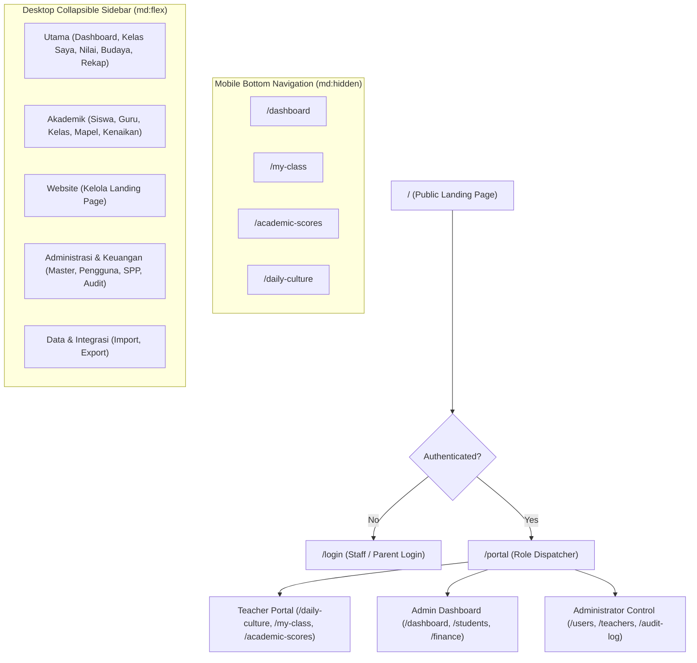
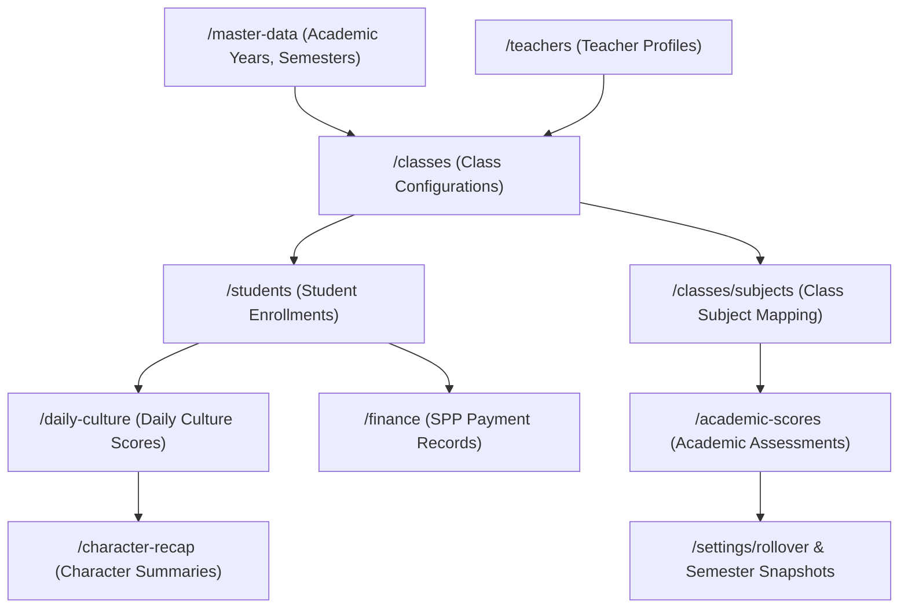
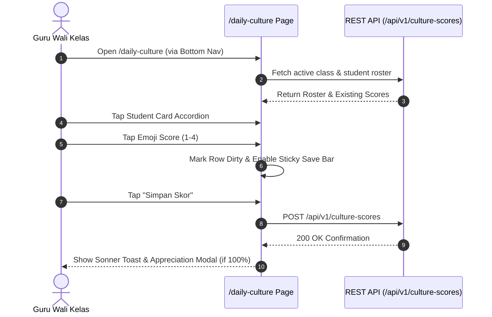

# SIUBA Information Architecture & Navigation Blueprint

## 1. System Navigation Hierarchy

---

## 2. Module Dependency Matrix

---

## 3. Task Flow Diagrams

### 3.1 Daily Culture Input Task Flow

---

## 4. Comprehensive Module Routing Reference

### 4.1 Module: Dashboard (`/dashboard`)
- **Purpose:** Executive status overview, health metrics, shortcut links, and watchlist notifications.
- **Entry Points:** Login redirect, Topbar logo tap, Mobile bottom nav item 1.
- **Exit Points:** Direct links to `/students`, `/finance`, `/daily-culture`, `/health-check`.
- **Dependencies:** Requires active session via `AuthProvider`.

### 4.2 Module: Students (`/students`)
- **Purpose:** Student registration, profile management, status changes, and parent PIN resets.
- **Entry Points:** Sidebar "Akademik" $\rightarrow$ "Siswa", Dashboard metric click.
- **Exit Points:** `/students/new`, `/students/[id]`, `/export`.
- **Dependencies:** Requires `administrator` or `admin` role.

### 4.3 Module: Daily Culture (`/daily-culture`)
- **Purpose:** Daily mobile input of student character indicators (*Budaya Harian SAHABAT*).
- **Entry Points:** Mobile bottom nav item 4, Sidebar "Utama" $\rightarrow$ "Budaya Harian".
- **Exit Points:** Return to `/dashboard` or `/character-recap`.
- **Dependencies:** Requires active `teacher` role and assigned class.

### 4.4 Module: Finance SPP (`/finance`)
- **Purpose:** Tuition fee tracking, payment entry, arrears report, and bulk verification.
- **Entry Points:** Sidebar "Administrasi" $\rightarrow$ "Keuangan (SPP)".
- **Exit Points:** Return to `/dashboard`.
- **Dependencies:** Requires `administrator` or `admin` role.

---

## 5. Architectural Recommendations

1. **Category Accordion State Persistence:**
   - *Current Behavior:* Sidebar categories (`openCategories`) reset to default on page load.
   - *Recommendation:* Persist accordion toggle state in `localStorage` or URL query params to preserve user context during multi-page administrative work.

2. **Unified Search Entry Point:**
   - *Current Behavior:* Search is localized within individual list views (`/students`, `/users`).
   - *Recommendation:* Introduce a global `Cmd + K` modal search in the Topbar to quickly jump to students, teachers, or classes from any screen.
