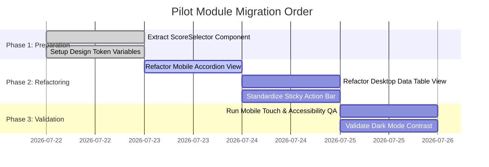

# SIUBA Phase 8 — Pilot Module Implementation Plan

## 1. Pilot Module Selection

### Selected Module: Budaya Harian (`/daily-culture`)

### Selection Justification & Criteria Assessment
1. **High Usage Frequency:** Used daily by all active teacher roles (`teacher`) to score 7 character indicators across class rosters ([daily-culture/page.tsx:L41-L49](file:///d:/w/siubapkbm/app/%28authenticated%29/%28modules%29/daily-culture/page.tsx#L41-L49)).
2. **Representative UI Architecture:** Features both Mobile Card Accordion views (`block md:hidden`) and Desktop Data Tables (`hidden md:block`), making it the ideal blueprint for dual-view mobile-first validation.
3. **Controlled Scope & Low Systemic Risk:** Scoped strictly to daily culture score entries without mutating root database schemas or core financial ledgers.
4. **Complete Component Representation:** Incorporates Page Headers, Filters (Class Select, Date Picker), Metric Cards, Score Radio Selectors, Sticky Action Bars, Confirmation Modals, and Toast Feedback.

---

## 2. Component Mapping Matrix

| Existing `/daily-culture` Implementation | Design System Target Standard | Refactoring Action |
| :--- | :--- | :--- |
| Inline `ScoreSelector` ([daily-culture/page.tsx:L82](file:///d:/w/siubapkbm/app/%28authenticated%29/%28modules%29/daily-culture/page.tsx#L82)) | Shared `@/components/ui/score-selector.tsx` | Extract to shared library component. |
| Hardcoded select inputs | Standardized `Select` control (`rounded-xl h-11`) | Apply semantic surface tokens (`bg-surface-1`). |
| Custom card accordion divs | Standardized `MobileCardAccordion` | Wrap in standard design token radius (`rounded-2xl`). |
| Sticky bottom bar (`sticky bottom-16`) | Standardized `StickyActionBar` | Align padding (`pb-20 md:pb-6`) and z-index (`z-30`). |

---

## 3. Phased Implementation Order

---

## 4. Regression Risks & Mitigation

| Potential Regression Risk | Risk Level | Mitigation Strategy |
| :--- | :--- | :--- |
| **Touch Collision on Mobile Save Bar** | High | Enforce `sticky bottom-16 md:bottom-4` docking directly above mobile bottom nav. |
| **Data Loss on Accidental Navigation** | Medium | Maintain dirty state tracking (`dirtyRows.length > 0`) and trigger `ConfirmDialog` before exit. |
| **Date Lock Logic Corruption** | High | Preserve client-side 7-day editing limit check for teacher role ([daily-culture/page.tsx:L196](file:///d:/w/siubapkbm/app/%28authenticated%29/%28modules%29/daily-culture/page.tsx#L196)). |

---

## 5. Rollback Strategy
If critical UI or data-saving regressions are detected during pilot deployment:
1. Revert `app/(authenticated)/(modules)/daily-culture/page.tsx` to pre-pilot git commit snapshot.
2. The REST API backend (`/api/v1/culture-scores`) remains untouched during UI refactoring, ensuring 100% backend stability.

---

## 6. Validation Checklist & Success Criteria
- [ ] Mobile Card Accordion renders without horizontal overflow on $360\text{px}$ viewports.
- [ ] All touch targets maintain minimum $44 \times 44\text{px}$ dimensions.
- [ ] Keyboard navigation (`Tab`, `Space`, `Enter`, `Arrows`) functions across score selection radios.
- [ ] Both Light mode (`#fdfbf7`) and Dark mode (`#0a0a0a`) meet WCAG AA contrast standards.
- [ ] 100% completion trigger successfully opens appreciation modal.
