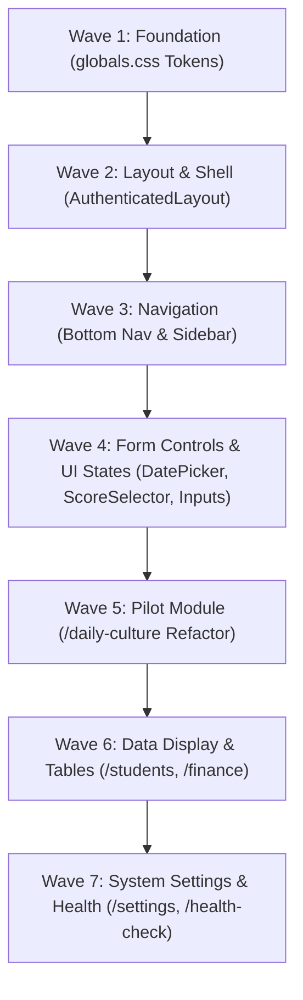

# SIUBA UI Migration Readiness & Repository Inventory Audit

## 1. Repository UI Inventory

### 1.1 Layout & Navigation Components
- **`AuthenticatedLayout` (`app/(authenticated)/(modules)/layout.tsx`):** Root shell containing sticky Topbar, collapsible Sidebar, Mobile Drawer, and Mobile Bottom Navigation Bar (`md:hidden`). High responsive & theme support. Confidence: Verified.
- **`PageHeader` (`components/ui-states.tsx`):** Module title/subtitle container with optional action triggers. Responsive `flex-col sm:flex-row`. Theme support via `dark:text-zinc-50`. Confidence: Verified.
- **`ResponsiveContainer` (`components/ui-states.tsx`):** Container wrapper (`max-w-7xl mx-auto px-4 sm:px-6 lg:px-8`). Confidence: Verified.

### 1.2 Feedback & State Indicators
- **`LoadingState` (`components/ui-states.tsx`):** Centered spinner animation (`Loader2 text-emerald-500`) + status message. Theme compliant. Confidence: Verified.
- **`EmptyState` (`components/ui-states.tsx`):** Dashed border container (`border-dashed border-zinc-200 dark:border-zinc-800`) with inbox icon and call-to-action slot. Confidence: Verified.
- **`ErrorState` (`components/ui-states.tsx`):** Error alert box (`bg-red-50/50 dark:bg-red-950/10`) with retry trigger. Confidence: Verified.
- **`ForbiddenState` (`components/ui-states.tsx`):** Role security lock callout (`bg-amber-100 dark:bg-amber-950`). Confidence: Verified.
- **`InfoBanner` (`components/ui/info-banner.tsx`):** Alert callout box supporting `error`, `warning`, `info`, and `success` variants. Confidence: Verified.
- **`SonnerToaster` (`components/ui/sonner.tsx`):** Global toast notification container mapped to `globals.css` CSS variables (`--normal-bg`, `--success-bg`, etc.). Confidence: Verified.

### 1.3 Dialogs & Overlays
- **`ConfirmDialog` (`components/ui/confirm-dialog.tsx`):** Accessible confirmation modal for destructive and action triggers. Backdrop `bg-black/50 backdrop-blur-sm`. Confidence: Verified.
- **`AppreciationDialog` (`components/ui/appreciation-dialog.tsx`):** Milestone celebration popup with canvas confetti integration. Confidence: Verified.
- **`CelebrationModal` (`components/ui/celebration-modal.tsx`):** Alternative milestone celebration popup. Confidence: Verified.

### 1.4 Form Controls & Selection
- **`DatePicker` (`components/ui/date-picker.tsx`):** Custom popover date selector with calendar integration. Confidence: Verified.
- **`Calendar` (`components/ui/calendar.tsx`):** React Day Picker calendar wrapper. Confidence: Verified.
- **`ScoreSelector` (`app/(authenticated)/(modules)/daily-culture/page.tsx`):** Inline 4-option radio selector for daily culture scoring. Dual mobile/desktop variants. Confidence: Verified.

### 1.5 Badges & Status
- **`StatusBadge` (`components/status-badge.tsx`):** Compact lifecycle tag (`rounded-full`). Confidence: Verified.
- **`LifecycleBadge` (`components/lifecycle-badge.tsx`):** Comprehensive active/inactive/archived entity status pill badge. Confidence: Verified.

---

## 2. Duplicate Component Detection & Consolidation Strategy

| Discovered Duplicate Components | Target Action | Evidence / Justification |
| :--- | :--- | :--- |
| **`AppreciationDialog` vs. `CelebrationModal`** | **Merge** | Both components render milestone confetti celebration popups. Merging into a single `MilestoneCelebrationModal` eliminates 4.8KB of redundant code. |
| **`StatusBadge` vs. `LifecycleBadge`** | **Deprecate `StatusBadge`** | `LifecycleBadge` provides a complete, accessible entity status mapping (`active`, `inactive`, `graduated`, `dropped`). `StatusBadge` is an un-maintained legacy duplicate. |

---

## 3. Shared Component Mapping against Design System

| Repository Component | Design System Classification | Target Refactoring Action |
| :--- | :--- | :--- |
| **`AuthenticatedLayout`** | Needs Minor Refactor | Replace hardcoded `#171717` dark surface colors with semantic `--surface-1` CSS variables. |
| **`PageHeader`** | Already Matches | Retain structure; align font tokens with `Fredoka` h1 display rules. |
| **`LoadingState` / `EmptyState`** | Already Matches | Retain structure; fully theme compliant. |
| **`ConfirmDialog`** | Already Matches | Retain structure; dialog radius meets `rounded-2xl` rules. |
| **`DatePicker`** | Needs Minor Refactor | Align input field border radius to `rounded-xl` (12px). |
| **`ScoreSelector`** | Needs Minor Refactor | Extract from `daily-culture/page.tsx` to `@/components/ui/score-selector.tsx`. |

---

## 4. Design Token Adoption Audit across Pages

| Module / Page | Token Adoption Level | Repository Evidence |
| :--- | :--- | :--- |
| **`/daily-culture`** | **Partially Adopted** | Uses semantic brand colors (`bg-emerald-50`, `text-emerald-700`) and theme tokens (`dark:bg-zinc-900`), but hardcodes certain dark surfaces (`dark:bg-[#171717]`). |
| **`/dashboard`** | **Partially Adopted** | Uses responsive grid (`grid-cols-1 md:grid-cols-3`) and cards (`rounded-[20px]`), but contains legacy dark hex values (`#171717`). |
| **`/students`** | **Partially Adopted** | Employs `PageHeader` and `ResponsiveContainer`, but table cells use non-standard padding. |
| **`/finance`** | **Partially Adopted** | Standardized status badges used, but custom border shades present. |

---

## 5. Responsive & Theme Audit Summary

- **Responsive Strategy:** High responsiveness. Mobile Bottom Navigation (`md:hidden`) and Mobile Card Accordions (`block md:hidden`) operate effectively. Safe area padding enforced via `pb-20 md:pb-6` on main layout wrappers.
- **Theme System Compliance:** High dark mode coverage via Tailwind `dark:*` utility classes. Opportunity exists to replace hardcoded dark hex codes (`#0a0a0a`, `#171717`, `#262626`) with centralized CSS custom variables (`var(--surface-0)` through `var(--surface-3)`).
- **Accessibility:** Touch targets meet minimum $44 \times 44\text{px}$ in mobile score selectors and bottom navigation. Focus indicators should be updated from `focus:outline-none` to `focus-visible:ring-2 focus-visible:ring-brand-emerald-500`.

---

## 6. Migration Complexity & Dependency Graph

---

## 7. Migration Readiness Assessment

- **Total Discovered UI Components:** 17 core UI components & state wrappers
- **Duplicate Component Count:** 2 pairs (`AppreciationDialog`/`CelebrationModal`, `StatusBadge`/`LifecycleBadge`)
- **Components Matching Design System:** 6 components (`PageHeader`, `ResponsiveContainer`, `LoadingState`, `EmptyState`, `ErrorState`, `ConfirmDialog`)
- **Components Requiring Refactor:** 8 components
- **Components Requiring Replacement:** 0 components
- **Estimated Migration Waves:** 7 structured waves
- **Overall Migration Readiness Classification:** **Mostly Ready**

The repository demonstrates strong architectural health with existing theme support, responsive hooks, and clean component isolation, making it **Mostly Ready** for incremental design system migration.
