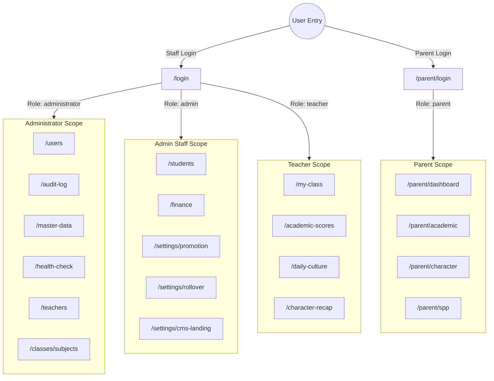
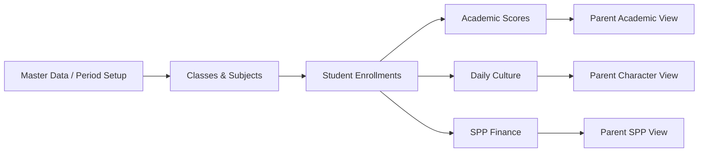

# Observable Relationship Map

This document maps relationships between personas, modules, screens, workflows, shared components, and backend services.

---

## 1. System Context & Persona Access Map

---

## 2. Business Dependency & Module Interconnection Map

---

## 3. Shared Component & Service Usage Matrix

| Shared Component | Used By Modules | Related Service | Primary Purpose |
| :--- | :--- | :--- | :--- |
| **`<Altcha />`** | Login, Parent Login | `securityUtils.ts` | Bot defense proof-of-work solver |
| **`<ConfirmDialog />`** | Students, Users, Finance, Settings | Global Modal | Destructive action confirmation |
| **`<LoadingState />`** | All Portal Modules | Global UI State | Async fetch spinner display |
| **`<ForbiddenState />`**| All Portal Modules | Global UI State | Role mismatch warning view |
| **`<DataTable />`** | Students, Users, SPP, Audit Logs | Global UI Component | Paginated grid data renderer |
| **`<SectionsTab />`** | CMS Landing Page | `websiteConfigService.ts` | Section configuration manager |
| **`<FitrahRadarChart />`**| Dashboard, Character, Parent Portal | `characterSummaryService.ts`| Character score visualization |
